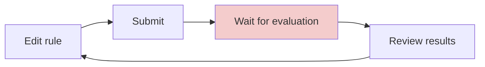
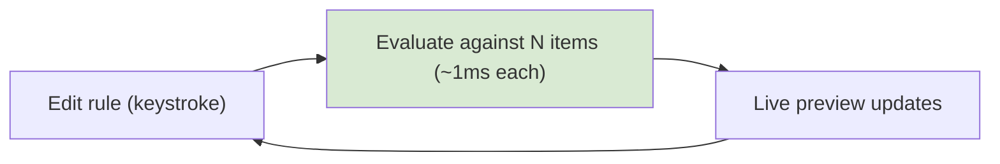

Taalas [just announced](https://taalas.com/the-path-to-ubiquitous-ai/) a hard-wired Llama 3.1 8B at 17K tokens/sec — ~10x state of the art. Custom silicon, model baked into the chip, aggressive quantization. Not competing on capability.

The obvious use cases don't hold up:

- Chatbots don't need sub-millisecond responses
- Document processing runs in background tasks — latency doesn't matter
- An 8B model isn't writing your code

The use case that does hold up is narrower: **authoring a natural-language rule and seeing it evaluated across a dataset in real time.**

## The iteration tax

A common workflow across many domains:

- Write a rule
- Run it against data
- Wait
- Review results
- Adjust, repeat



- The rule is natural language or semi-structured text
- The "evaluation" requires judgment, not just pattern matching
- At current speeds, each loop iteration involves a meaningful wait
- So the loop runs a handful of times, the rule ships undertested
- Real feedback comes from production

## What changes at sub-millisecond

The loop collapses into direct manipulation — like a spreadsheet recalculating on every cell edit, except the "calculation" is an LLM applying your rule against each item.



```python
async def evaluate_rule_against_dataset(
    rule: str,
    dataset: list[Record],
    model: InferenceClient,
) -> list[EvaluationResult]:
    """Fan out a natural-language rule against every record.

    At ~1ms per call, 100 records complete in ~100ms —
    fast enough to run on every debounced keystroke.
    """
    return await asyncio.gather(*[
        model.evaluate(rule=rule, record=record)
        for record in dataset
    ])
```

- 100 records × 1ms each, in parallel: ~100ms wall time
- Same operation at 200ms/call: 20 seconds
- The threshold isn't about any single call — it's **call density per interaction**

## Three variations

The specifics vary. The pattern is consistent.

### Policy against a portfolio

- Fraud analyst writes a detection rule
- System evaluates it against 10,000 historical transactions, live
- Analyst adjusts wording, watches flag count change before shipping

```
Rule: "Flag if merchant category doesn't match
       customer's typical spending pattern"

847 / 10,000 flagged (8.5%)

  [adjust "typical" → "last 90 days"]

320 / 10,000 flagged (3.2%)
```

Other examples: underwriting criteria, prior authorization rules, insurance claim policies, moderation policies, risk scoring.

### Instruction against diverse inputs

- Prompt engineer edits a system prompt
- 20 test conversations re-generate simultaneously
- Failure modes get caught at authoring time, not in production

```
┌─ Test 1: "refund my order"       → ✓ on-policy
├─ Test 2: "your product sucks"    → ✓ on-policy
├─ Test 3: "speak to a human"      → ✗ should offer
│                                     resolution first
├─ ...17 more cases
│  17/20 on-policy
└──────────────────────────────────────────────
```

Other examples: extraction rule authoring, chatbot tuning, grading rubrics, routing rules, data quality definitions.

### Criteria against a candidate pool

- Recruiter edits job requirements
- Applicant pool re-filters in real time
- Tradeoff between strictness and pool size becomes visible immediately

```
"5+ years backend, distributed systems"  → 12 / 340
  [change "5+" to "3+"]                  → 47 / 340
  [add "healthcare preferred"]           → 8 / 340
```

Other examples: lead scoring, vendor evaluation, audience segmentation, data labeling guidelines.

## Why this needs speed, not intelligence

| Inference speed | 100 evaluations | 1,000 evaluations | UX |
|---|---|---|---|
| 200ms/call | 20s | 200s | Submit and wait |
| 50ms/call | 5s | 50s | Slow preview |
| 1ms/call | 100ms | 1s | Live, on keystroke |

- The product isn't "AI evaluation"
- The product is **the feedback loop being fast enough to feel like direct manipulation**
- That's a call-density problem, not a model-capability problem
- An 8B model with aggressive quantization is fine — the evaluation per record is simple
- You don't need a frontier model to decide whether a transaction matches a spending pattern
- You need a model that can do it a thousand times in a second

## Honest caveats

- **Context window limits.** Each record needs to fit in a short context. Long documents break the pattern.
- **Accuracy at 3-bit quantization.** For aggregate patterns (847/10,000 flagged), occasional per-record errors are tolerable. For workflows where each evaluation matters, they're not.
- **Frozen model.** Taalas claims two-month turnaround for new models. Fine for classification tasks. Problem for anything needing current knowledge.
- **200ms might be good enough.** A fast hosted API with aggressive parallelism gets you to "tolerable preview." The gap between "tolerable" and "feels like a spreadsheet" is real, but it's UX, not a new capability.

---

Sub-millisecond small model inference doesn't make existing LLM features faster. It makes one specific class of product viable: tools where authoring depends on evaluating fuzzy logic against a dataset at interactive speed. That's a narrower claim than "ubiquitous AI," but it's the one that survives scrutiny.

---

*This post was written with assistance from slow, smart AI.*
